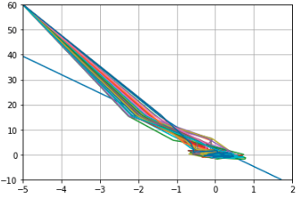
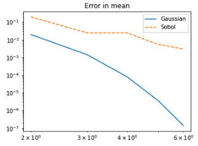
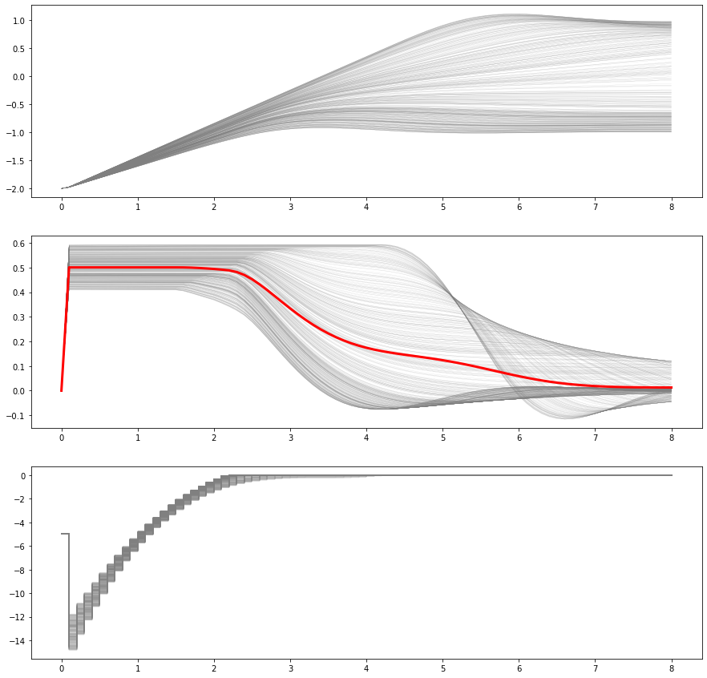

# stochastic_mpc

## Linear SMPC

1. The first application is from the paper **Explicit use of probabilistic distributions in linear predictive control**. The prescribed probabilisitc constraints are reformulated into deterministic constraints by using the approaches described in the book "model predictive contro classical, robust and stochastic", p. 304-311.

   

2. Generalized Polynomial Chaos (gPC)

   1. Results comparison between pseudo-projection and point collocation using sobol for the system$\frac{d x(t)}{d t}=-\theta x(t)+w(t), x(0)=1$, where $\theta \sim \mathcal{N}(0,1)$ and $w(t) \sim \mathcal{N}(0,1)$ in the paper  "An efficient method for stochastic optimal control with joint chance constraints for nonlinear systems"

      

3. Modified algorithm based on the paper "Nonlinear stochastic model predictive control via regularized polynomial chaos expansions"
   1. 
